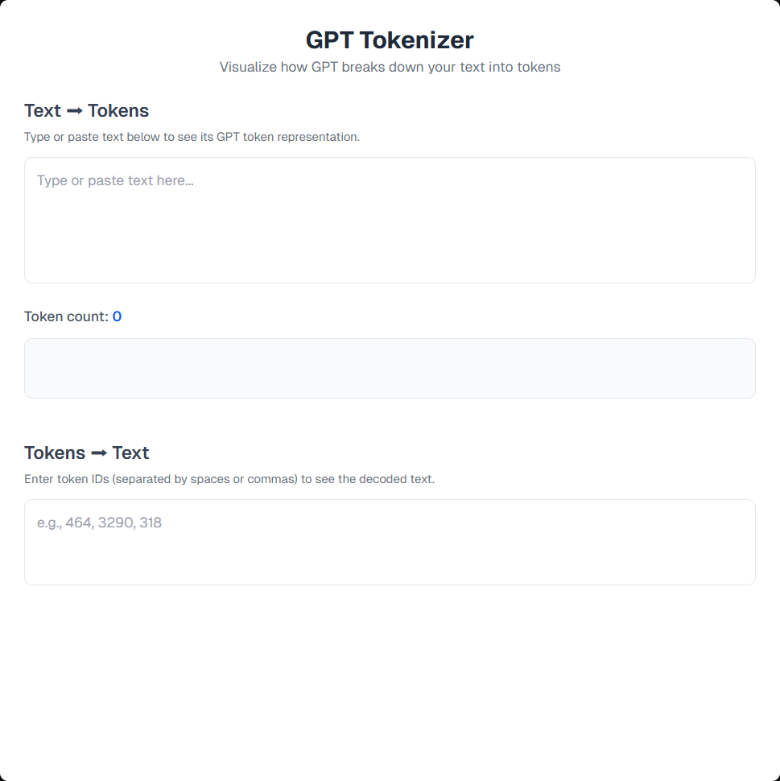

# GPT Tokenizer

A simple, colorful, real-time tokenizer built with **Next.js** and the [`gpt-tokenizer`](https://www.npmjs.com/package/gpt-tokenizer) package.
It visualizes how GPT models break down your text into tokens and lets you reverse tokens back into text.

## ✨ Features

* **Token details** – View both the text and token ID.
* **Color-coded tokens** – Each token gets a unique color for clarity.
* **Click-to-copy** – Copy individual token IDs.
* **Copy all** – Copy all tokens at once.
* **Reverse tokenization** – Convert token IDs back into text.

## 🚀 Installation

```bash
# Clone the repository
git clone https://github.com/mohdaffankhan/GPT-Tokenizer.git

# Navigate into the project folder
cd GPT-Tokenizer

# Install dependencies
npm install

# Run the development server
npm run dev
```

## 📦 Usage

1. Type or paste your text into the input box.
2. Tokens will appear below, each with its token ID.
3. Click a token to copy its ID, or use **Copy All Tokens** to copy them all.
4. Use the reverse section to paste token IDs and get the original text.

## 🛠 Tech Stack

* **Next.js** – Frontend framework
* **React** – UI library
* **Tailwind CSS** – Styling
* **gpt-tokenizer** – GPT-compatible tokenizer

## 📷 Preview



## 📄 License

MIT License. Feel free to use and modify.

